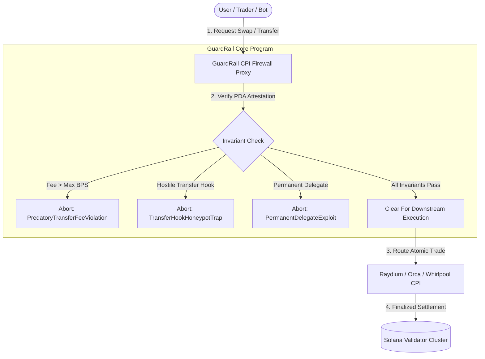

<div align="center">

# 🛡️ GuardRail Protocol
### Zero-Trust Pre-Execution Firewall & Token-2022 Forensic Auditor on Solana

[](https://solana.com)
[](https://anchor-lang.com)
[](https://nextjs.org)
[](LICENSE)
[](https://colosseum.org)

**Built for Colosseum Crypto World's Fair & Superteam SolanaCZE Hackathon Track.**

[Live Application](https://guardrail-protocol.vercel.app) • [Developer SDK](#-developer-integration-sdk--cli) • [On-Chain Architecture](#-smart-contract-architecture) • [Security Model](#-zero-trust-threat-model)

</div>

---

## ⚡ Executive Summary

With the mass adoption of the **SPL Token-2022** standard, malicious actors deploy predatory honeypots and drain mechanics that standard Solana wallets (Phantom, Solflare) and DEX interfaces fail to detect prior to transaction signature:

- **99% Hidden Transfer Fees (Taxes)** siphoned directly to fee collectors.
- **Predatory Transfer Hook CPIs** that execute malicious bytecode on every trade, freezing wallets or reverting sells.
- **Permanent Delegate Confiscation** allowing central authorities to burn or seize token holder balances without approval.
- **Default Account Freezing** locking newly minted recipient accounts.

**GuardRail Protocol** provides an immutable, pre-execution security layer. It acts as an active **on-chain firewall and byte-level decompiler**, verifying contract invariants before downstream transactions occur.

---

## 🔬 Core Features & Forensic Capabilities

### 1. Active Anchor CPI Invariant Firewall (`programs/guardrail`)
An on-chain Anchor smart contract deployed on Solana. Protocols, DEX routers (Raydium, Orca), and trading bots can call `guard_pre_execution_swap` via Cross-Program Invocation (CPI) to atomically abort malicious transactions before funds are committed:
- Enforces strict `max_allowed_tax_bps`.
- Enforces `assert_no_transfer_hooks`.
- Blocks tokens utilizing active `PermanentDelegate` seizure keys.
- Records verifiable audit attestations in Program Derived Addresses (PDAs) with cryptographic hash proofs.

### 2. Byte-Level TLV Storage Decompiler
Directly dissects validator account memory buffers:
- Differentiates legacy 82-byte SPL mints from Token-2022 extended structures.
- Parses Type-Length-Value (TLV) extension type IDs (`0x01` TransferFee, `0x0E` TransferHook, `0x0F` PermanentDelegate).
- Displays raw memory offsets (`0x00 - 0x80+`) directly in the UI.

### 3. Zero-Risk Pre-Flight Simulation Sandbox
Executes headless dummy swaps against live Solana RPC nodes without risking user capital. Analyzes runtime instruction logs and compute units (CU) to confirm whether sell-routes are operational or obstructed by honeypot logic.

### 4. Multi-DEX Execution Router with Fallbacks
Seamless routing for verified assets through **Jupiter Aggregator**, with direct fallback links to **Raydium AMM** and **DexScreener** for unindexed or newly launched liquidity pools.

### 5. Cryptographic Proofs & High-Res PDF Audit Certificate
- Generates downloadable, verifiable **JSON Cryptographic Proofs** for CI/CD pipelines.
- Instant export to **formal landscape A4 PDF Audit Certificates** featuring the official GuardRail seal, attestation slot, and forensic breakdown.

---

## 🏛️ Smart Contract Architecture



---

## 💻 Developer Integration SDK & CLI

### 1. Automated CI/CD Audit CLI
Add GuardRail security verification to your GitHub Actions or deployment pipeline:

```bash
npx guardrail-scanner <TARGET_MINT> \
  --cluster devnet \
  --max-tax-bps 500 \
  --assert-no-transfer-hooks \
  --strict
```

### 2. Pre-Execution TypeScript Integration (Jupiter / Trading Bots)

```typescript
import { Connection, PublicKey } from '@solana/web3.js';
import { GuardRailInspector } from '@guardrail/firewall-sdk';

const inspector = new GuardRailInspector('https://api.devnet.solana.com');
const report = await inspector.inspectMint(targetMint);

if (report.isHoneypot || report.riskScore > 70) {
  throw new Error(`[GUARDRAIL FIREWALL] Aborted! Malicious Mint: ${report.classification}`);
}

// Mint cleared: execute atomic swap safely
await executeSwap(targetMint);
```

### 3. Anchor CPI Invocation (Rust)

```rust
pub fn safe_swap(ctx: Context<SafeSwap>, max_tax_bps: u16) -> Result<()> {
    guardrail::cpi::guard_pre_execution_swap(
        CpiContext::new(ctx.accounts.guardrail_program.to_account_info(), GuardPreExecutionSwap {
            attestation: ctx.accounts.attestation.to_account_info(),
            mint: ctx.accounts.mint.to_account_info(),
            user_authority: ctx.accounts.user.to_account_info(),
        }),
        max_tax_bps,
        false, // Disallow hostile honeypot transfer hooks
    )?;

    // Safe to route trade to Raydium / Orca CPI
    Ok(())
}
```

---

## 🚀 Quickstart & Local Setup

### Prerequisites
- Node.js >= 18.x
- Rust & Solana CLI (for Anchor contract development)

### Installation

```bash
# Clone the repository
git clone https://github.com/Ra9mirez11/guardrail-protocol.git
cd guardrail-protocol

# Install dependencies
npm install

# Configure environment variables
cp .env.example .env.local

# Run Next.js Development Server
npm run dev
```

Open [http://localhost:3000](http://localhost:3000) to inspect tokens in real-time.

---

## 📄 License & Attribution

This project is licensed under the **MIT License** - see the [LICENSE](LICENSE) file for details.  
Copyright (c) 2026 **Bohumel (Ra9mirez11) & GuardRail Protocol Team**.